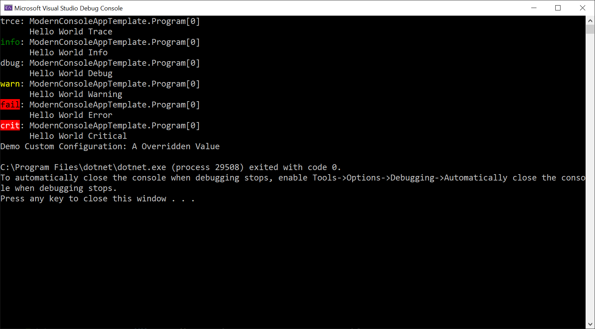

Very rough VS Project Template for a .NET Core Console app
with Dependency Injection, Configuration and Logging

[Developer Community Feature Request](https://developercommunity.visualstudio.com/idea/651671/net-core-console-template-with-di-logging-config.html)

[Twitter discussion](https://twitter.com/spottedmahn/status/1151911538183364609?s=20)

**Reference Blog Posts** I used to Put this Together:

- DI: https://gunnarpeipman.com/net/net-core-dependency-injection/
- Config: https://garywoodfine.com/configuration-api-net-core-console-application/
- Logging: https://www.blinkingcaret.com/2018/02/14/net-core-console-logging/